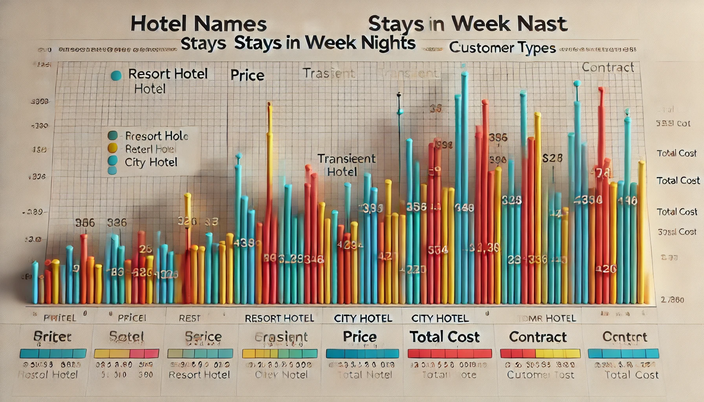
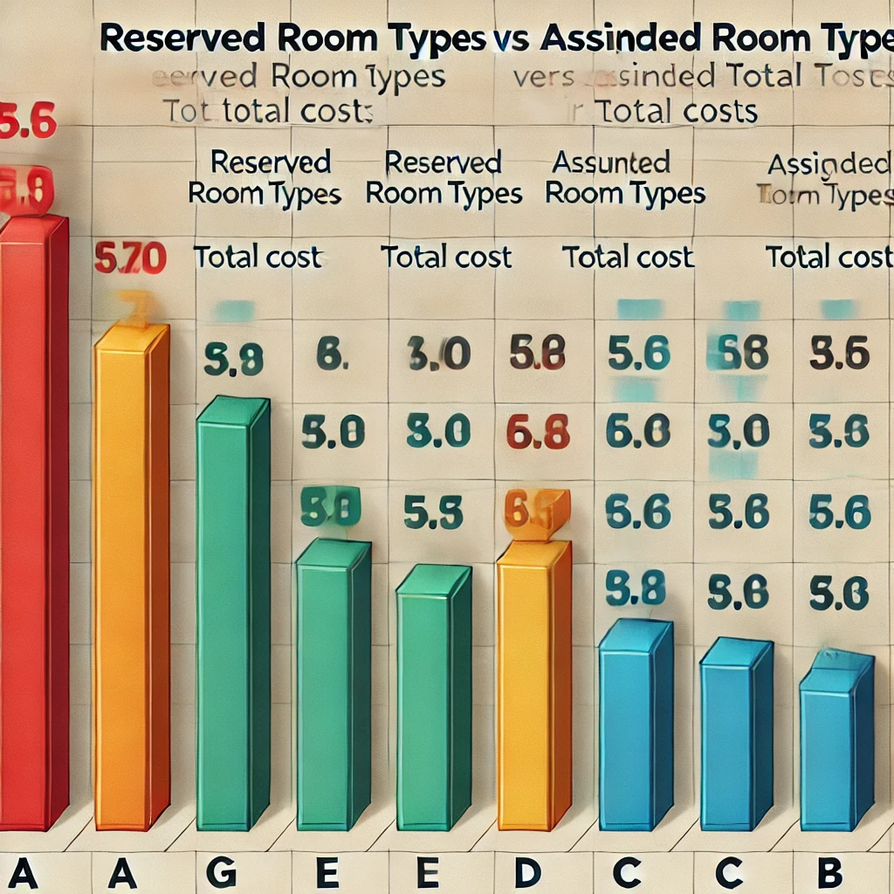

# SQL_Hotel_Booking

## Introduction:

In this analysis, we explore hotel booking patterns, pricing, and customer behavior using a dataset from **City Hotel** and **Resort Hotel**. The primary objective is to examine the relationships between stay **durations, room types, total costs**, and **customer categories** such as **families, couples, and singles**. Additionally, the analysis delves into cancellations and pricing trends for various room types, comparing assigned and reserved rooms, and looking at the impact of refund policies.

The data provides insights into:

- **Hotel preferences** among different customer types (families, couples, and singles).
- The relationship between stay **duration** and **total cost**.
- Price comparisons between **reserved room types** and the **actual rooms assigned** at check-in.

This analysis is valuable for hotel management, as it sheds light on booking behavior, potential revenue from extended stays, and the importance of room type management to maximize profits. Understanding these trends can help optimize pricing strategies and improve customer satisfaction by aligning room offerings with customer preferences.

Link: [SQL Report Work](/Advance_View/)

## Background

Hotel booking data provides critical insights into customer behavior, pricing strategies, and room management for the hospitality industry. In this analysis, we work with data from two types of hotels: **City Hotel** and **Resort Hotel**, both catering to different customer segments and offering varied room types, pricing structures, and amenities. The dataset includes details such as:

- **Hotel type** (City vs. Resort)
- **Customer demographics**: number of adults, children, and customer type (family, couple, single)
- **Booking details**: stay durations, pricing, refund policies, and cancellations

The core objective of the analysis is to uncover patterns in booking behavior and identify key trends in pricing and customer preferences. This is essential for:

- **Optimizing hotel revenue**: Understanding how different customer segments respond to pricing and room types can help hotels adjust rates and offerings.
- **Reducing cancellations**: By identifying the characteristics of bookings that are frequently canceled, hotels can create better policies to minimize revenue loss.
- **Improving room assignment**: By comparing reserved and assigned room types, the analysis provides insights into whether customer expectations align with their actual experiences.

This dataset is reflective of typical hotel management challenges, such as handling a diverse customer base, balancing room availability, and dealing with cancellations. Through careful analysis, hotel managers can tailor their operations to meet customer demands more effectively, maximize occupancy, and increase profits.

## Tools that been used

- **SQL**: Used to script and query data for analysis.
- **PostgreSQL**: Serves as the database management system for storing and organizing job postings
data.
- **VS Code**: Employed for database management and executing SQL queries.
- **Git & GitHub**: Used for version control, collaboration, and project tracking, ensuring seamless teamwork and project management.

## The Analysis

### Key Analysis Insights

#### 1. Booking Behavior by Customer Type:

- We categorized customers into **families**, **couples**, and **singles** based on the number of adults and children in each booking.

- The analysis revealed that the majority of bookings were made by **families**, indicating a preference for family-oriented accommodations.

- Understanding this trend helps hotels tailor their services, such as offering family-friendly amenities and activities to cater to this dominant customer segment.

| Total Family | Total Couple | Total Single |
|--------------|--------------|--------------|
| 16           | 4            | 1            |

- **Family Preferences:** The data clearly shows that families are the dominant customer group. Hotels should focus on creating family-friendly environments, such as offering family suites, kid-friendly activities, and group discounts.

- **Couples:** With 4 bookings, couples are a smaller but still significant segment. Hotels could cater to this group by providing romantic getaway packages, couple’s activities, and special offers for two-person stays.

- **Singles:** With just 1 booking, singles are the smallest group, which may suggest that the hotel’s offerings are more tailored to group stays rather than solo travelers. However, there is an opportunity to expand this market by creating solo traveler-friendly packages or advertising more effectively to single guests.

In conclusion, the hotel can prioritize family-oriented services while still catering to couples and singles to diversify its customer base.

```sql
SELECT 
    SUM(CASE WHEN adults >= 2 AND children > 0 THEN 1 ELSE 0 END) AS total_family,
    SUM(CASE WHEN adults = 2 AND children = 0 THEN 1 ELSE 0 END) AS total_couple,
    SUM(CASE WHEN adults = 1 AND children = 0 THEN 1 ELSE 0 END) AS total_single
FROM Hotel_booking_system;
```
#### 2. Price and Stay Duration:

- By analyzing the column **"stays_in_week_nights"** alongside the **"price"** column, we calculated the total cost incurred by customers based on their stay durations.

- The analysis showed that **Resort Hotels** tend to have longer stays with higher total costs compared to City Hotels, suggesting that Resort Hotels may attract guests looking for extended vacations, while City Hotels cater to shorter, more business-oriented stays.

| Hotel        | Stays in Week Nights | Price  | Total Cost | Customer Type     |
|--------------|----------------------|--------|------------|-------------------|
| Resort Hotel | 25                   | 240.00 | 6000.00    | Transient         |
| Resort Hotel | 25                   | 176.00 | 4400.00    | Transient         |
| Resort Hotel | 25                   | 158.77 | 3969.25    | Transient         |
| Resort Hotel | 25                   | 153.00 | 3825.00    | Transient         |
| Resort Hotel | 25                   | 147.00 | 3675.00    | Transient         |
| Resort Hotel | 25                   | 142.03 | 3550.75    | Transient         |
| Resort Hotel | 25                   | 135.00 | 3375.00    | Transient         |
| Resort Hotel | 25                   | 134.00 | 3350.00    | Transient         |
| Resort Hotel | 25                   | 134.00 | 3350.00    | Transient         |
| Resort Hotel | 25                   | 134.00 | 3350.00    | Transient         |
| Resort Hotel | 25                   | 134.00 | 3350.00    | Transient         |
| Resort Hotel | 25                   | 134.00 | 3350.00    | Transient         |
| Resort Hotel | 25                   | 120.60 | 3015.00    | Transient         |
| Resort Hotel | 25                   | 118.00 | 2950.00    | Transient         |
| Resort Hotel | 5                    | 200.00 | 1000.00    | Transient         |
| Resort Hotel | 3                    | 180.80 | 542.40     | Transient-Party   |
| Resort Hotel | 3                    | 150.75 | 452.25     | Transient         |
| Resort Hotel | 3                    | 150.75 | 452.25     | Transient         |
| Resort Hotel | 3                    | 150.75 | 452.25     | Transient         |
| Resort Hotel | 3                    | 150.75 | 452.25     | Transient         |
| City Hotel   | 4                    | 110.40 | 441.60     | Transient         |
| City Hotel   | 2                    | 200.50 | 401.00     | Contract          |
| City Hotel   | 2                    | 200.50 | 401.00     | Contract          |
| City Hotel   | 2                    | 200.50 | 401.00     | Contract          |
| City Hotel   | 2                    | 200.50 | 401.00     | Contract          |
| City Hotel   | 2                    | 145.30 | 290.60     | Transient         |
| City Hotel   | 1                    | 90.50  | 90.50      | Contract          |



Here's an explanation of the provided data for each hotel, based on the stays in weeknights, price, total cost, and customer type:

##### Resort Hotel:
- **Stays:** 25 nights (long stay) for most entries.
- **Price:** The price per night starts from $118.00 and goes up to $240.00.
- **Total Cost:** For long stays, total costs range from $2,950.00 to $6,000.00.
- **Customer Type:** Primarily "Transient" customers, which indicates guests staying temporarily, typically not with a negotiated contract. There is also one "Transient-Party" booking for a shorter stay (3 nights).
- **Shorter stays** (3 to 5 nights) are at lower total costs ($542.40, $452.25), and the price per night for these is slightly lower.

##### City Hotel:

- **Stays:** Most stays are between 1 and 4 nights.
- **Price:** Prices per night vary between $90.50 and $200.50.
- **Total Cost**: Total costs range from $90.50 for a single-night stay to $441.60 for a 4-night stay.
- **Customer Type:** There are both "Transient" and "Contract" guests, with contract guests paying a fixed price of $200.50 per night across multiple bookings (usually for 2 nights). Contract guests likely have pre-negotiated terms.


##### Insights:

- **Resort Hotel:** Attracts longer stays, particularly transient customers, with a wide price range, though the cost per night decreases for longer stays.
- **City Hotel:** Attracts both transient and contract customers, with relatively shorter stays and consistent pricing, especially for contract customers.

The pricing structure seems to favor long stays at Resort Hotel and shorter, possibly business-related stays at City Hotel.

```sql
SELECT hotel, stays_in_week_nights, price, 
       (stays_in_week_nights * price) AS total_cost, customer_type
FROM Hotel_booking_system
ORDER BY total_cost DESC;
```

#### 3.Total Costs Based on Room Types:

- The analysis showed how the total cost varies depending on the **reserved** and **assigned room types.**
- This insight allows hotels to understand which room categories generate the most revenue, helping them to prioritize higher-demand rooms and adjust pricing strategies accordingly.

| Reserved Room Type | Assigned Room Type | Total Cost  |
|--------------------|--------------------|-------------|
| A                  | A                  | 28,766.40   |
| G                  | G                  | 6,000.00    |
| E                  | E                  | 4,400.00    |
| D                  | D                  | 3,969.25    |
| A                  | E                  | 3,825.00    |
| C                  | C                  | 3,550.75    |
| A                  | D                  | 3,350.00    |
| B                  | C                  | 1,604.00    |
| C                  | A                  | 1,000.00    |
| C                  | B                  | 441.60      |
| A                  | C                  | 290.60      |
| B                  | B                  | 90.50       |




This data compares the reserved room types with the actual assigned room types and the total cost for each booking:

##### 1.Matching Room Types:

- **A → A:** Total cost of $28,766.40, indicating a high-cost, likely long-term stay.
- **G → G:** $6,000.00, suggesting a high-end room at a fixed rate.
- **E → E:** $4,400.00, medium-range room, consistent with expectations.
- **D → D:** $3,969.25, another consistent assignment with the reserved type.
- **C → C:** $3,550.75, moderate cost for this type.
- **B → B:** $90.50, a very low-cost, likely short-term stay.

##### 2.Mismatched Room Types:

- **A → E:** $3,825.00. Although the reserved type was A, they were assigned an E, possibly a downgrade.
- **A → D:** $3,350.00. Similar situation with a different room type than reserved.
- **B → C:** $1,604.00, a moderate-cost booking with an upgrade.
- **C → A:** $1,000.00. A lower-cost reserved room was upgraded to an A room.
- **C → B:** $441.60. A lower-cost option, with an assignment change to a B room.
- **A → C:** $290.60. Significant price drop from reserved A to assigned C.

##### Insights:

- The majority of room assignments matched the reserved types, which is likely ideal for guest satisfaction.
- Some rooms had mismatches between reserved and assigned types, with both upgrades and downgrades happening, influencing the total cost. The highest total cost occurred with a matching assignment of type A rooms.

```sql
SELECT reserved_room_type, assigned_room_type, 
       SUM(stays_in_week_nights * price) AS total_cost
FROM Hotel_booking_system
GROUP BY reserved_room_type, assigned_room_type
ORDER BY total_cost DESC;
```


#### Importance of These Analyses

- **Customer Segmentation:** Helps hotels design targeted marketing campaigns and create customized packages for families, couples, and single travelers.
- **Revenue Management:** By understanding the relationship between stay duration and pricing, hotels can optimize their pricing strategies for different customer segments and lengths of stay.
- **Room Allocation:** Addressing mismatches between reserved and assigned rooms can enhance guest satisfaction and retention, improving the overall customer experience.

## What I Learned

Here’s what can be learned from the data analysis:

- **Room Type Matching:** The majority of the reservations had the same reserved and assigned room types. For example, "A" reserved rooms were assigned "A" rooms, contributing to the highest total cost. This consistency reflects a stable room allocation process.
- **Upgrade/Downgrade Scenarios:** Some cases show a difference between reserved and assigned room types, such as when "A" rooms were reserved but "E" rooms were assigned. These changes may indicate room upgrades or downgrades based on availability, preferences, or operational needs.
- **Cost Distribution:** The data highlights how different room types contribute to overall costs. Reserved rooms that were matched with high-demand room types, such as "A" or "G," resulted in significant total costs. The total cost for room type "A" is notably higher than the others, possibly due to higher demand or luxury status.
- **Discrepancies and Impact on Revenue:** In some cases where the reserved and assigned room types don’t match, this could impact customer satisfaction, which might affect overall revenue and customer retention. For instance, if a guest reserved "A" but was assigned a lower-tier room like "C," it could lead to complaints or dissatisfaction.
- **Efficiency in Room Allocation:** The relatively low frequency of mismatches between reserved and assigned rooms suggests that the hotel's room allocation system is generally effective in meeting customer expectations.

These insights help to understand room allocation trends, customer preferences, and their impact on revenue, enabling strategic adjustments in the hotel's booking and assignment process.

## Conclusions

Here are some key conclusions from the analysis:

- **Room Allocation Efficiency:** The hotel shows a high level of efficiency in room allocation, as most of the reserved rooms are assigned to the same type. This consistency in delivering the reserved room type likely enhances customer satisfaction.
- **Revenue Concentration:** Rooms of type **"A" and "G"** generated the highest total costs, indicating that these room types are either more popular or higher priced. This suggests that focusing on these rooms could be beneficial for maximizing revenue.
- **Room Mismatches:** Though infrequent, there are instances of room mismatches (e.g., reserved **"A"** but assigned **"E"**). These cases could be due to operational issues or upgrades/downgrades and may require attention to minimize customer dissatisfaction.
- **Room Type Impact on Cost:** Different room types clearly impact the total cost. The **"A"** rooms significantly contribute to revenue, followed by other types like **"G"** and **"E."** This data could be used to optimize room pricing strategies.
- **Room Assignment Adjustments:** For better customer experience and operational efficiency, the hotel could analyze why mismatches occur and adjust their process accordingly to ensure guests get the rooms they reserved more frequently.

In summary, the hotel’s room allocation system is functioning well, but attention to the few mismatches could help improve customer satisfaction and further optimize revenue potential.